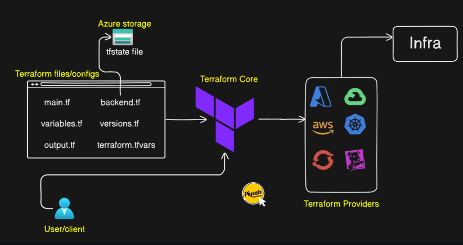
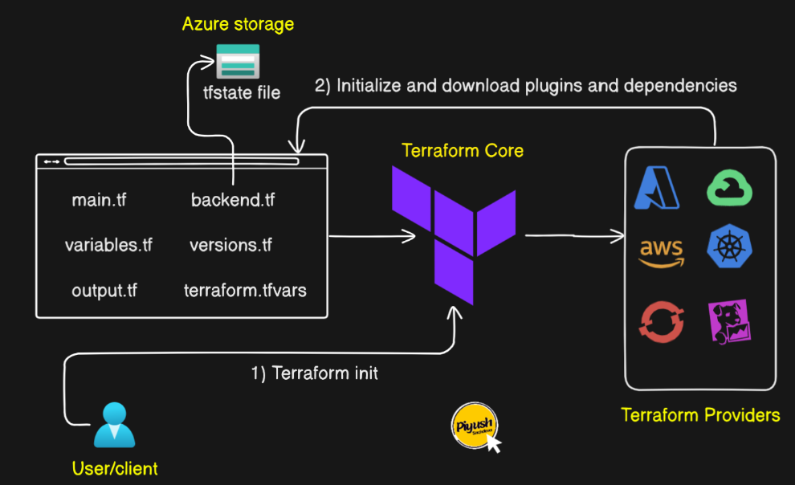
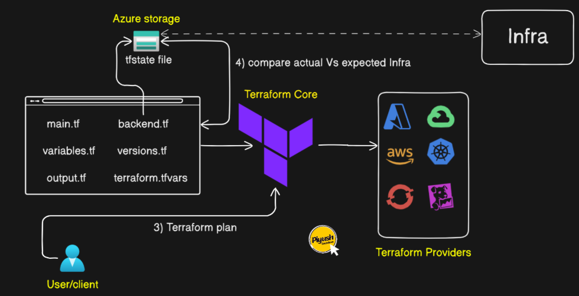
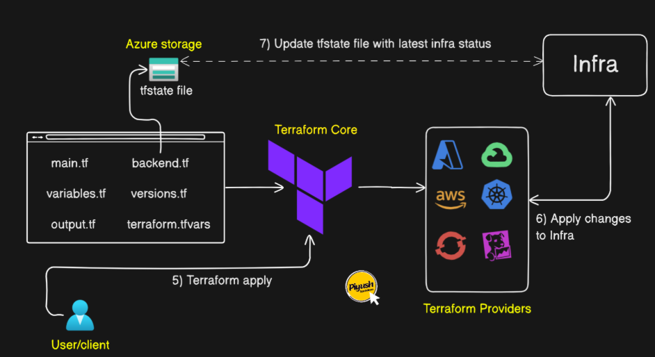
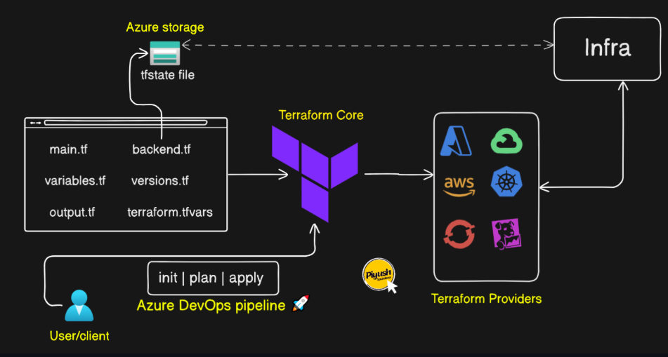

## This Terraform project demonstrates how to use Terraform with Azure Devops. 

- In this project we would provision the infrastructure (VMs, Network Interface, Backend bucket, etc) using Terraform as IAC. 
- Below picture shows the Terraform infrastructure set up. 



- Initializing the repository would download plugins/dependencies and would also create the tfstate files in the .terraform directory.

```bash
terraform init
```



- Running terraform plan, compares actual vs expected infra using the terraform.tfstate file. 

```bash
terraform plan
```



- Running terraform apply, would provision your resources accordingly. Updates the tfstate file with latest infrastructure status. 

```bash
terraform apply
```



- Implementing this with Azure Devops Pipeline, we just need to integrate these commands to the azurepipeline yaml file. See sample infra set up below: 

