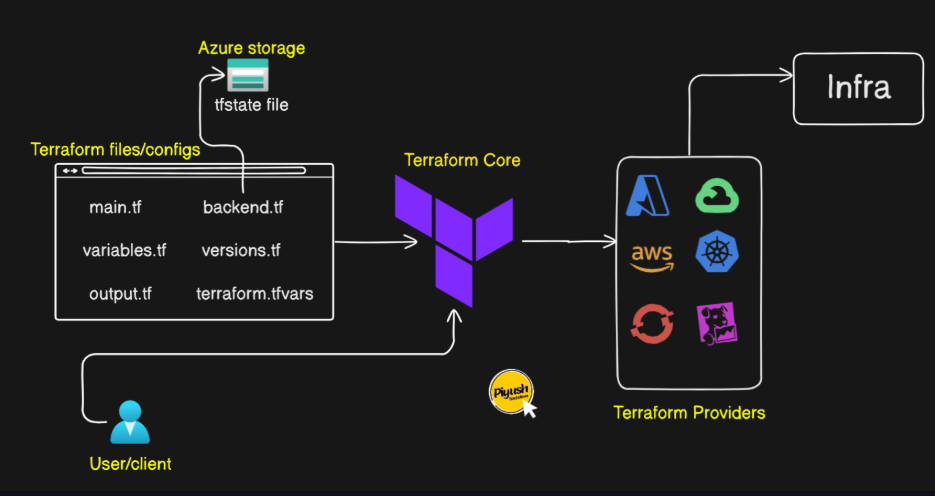
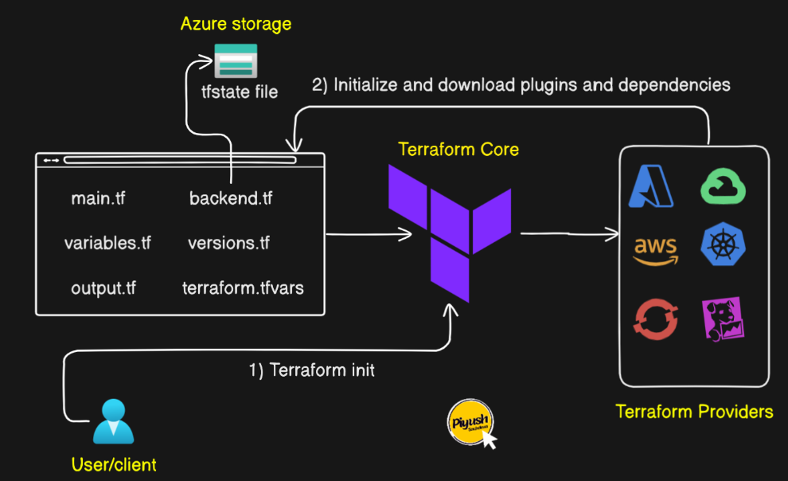
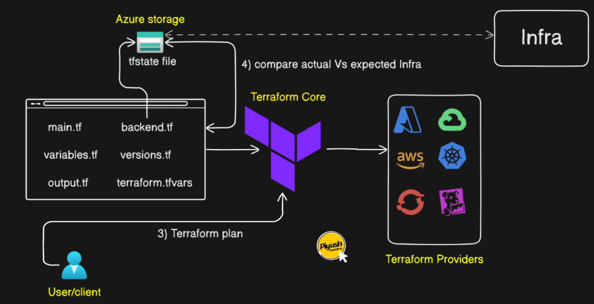
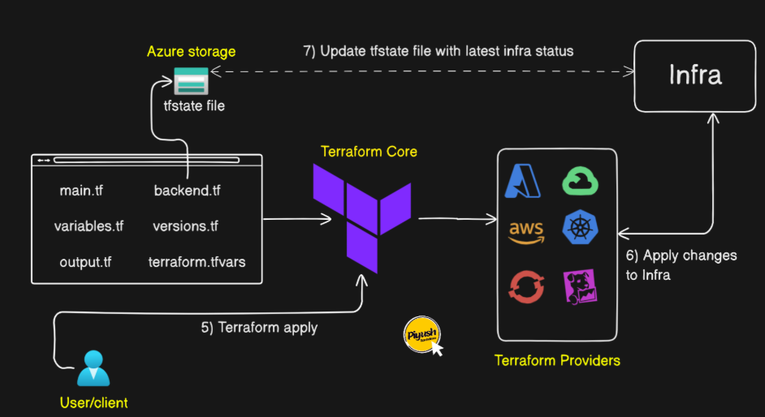
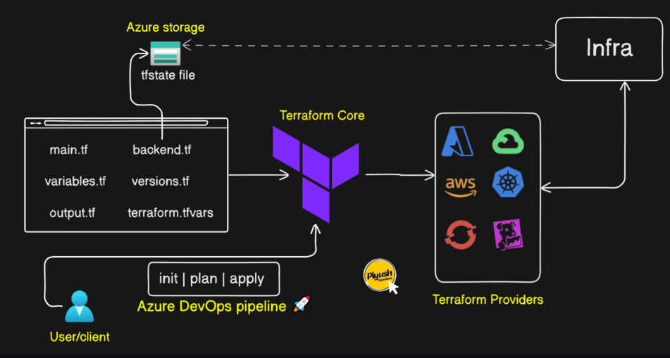

# This Terraform project demonstrates how to use Terraform with Azure Devops

- In this project we would provision the infrastructure (VMs, Network Interface, Backend bucket, etc) using Terraform as IAC.
- Below picture shows the Terraform infrastructure set up.



- Initializing the repository would download plugins/dependencies and would also create the tfstate files in the .terraform directory.

```bash
terraform init
```



- Running terraform plan, compares actual vs expected infra using the terraform.tfstate file.

```bash
terraform plan
```



- Running terraform apply, would provision your resources accordingly. Updates the tfstate file with latest infrastructure status.

```bash
terraform apply
```



- Implementing this with Azure Devops Pipeline, we just need to integrate these commands to the azurepipeline yaml file. See sample infra set up below:



- Creating a new Terraform Service principal for deploying applications

```bash
az login --tenant xxxxxxxx-xxxx-xxxx-xxxx-xxxxxxxxxxxx
az account show --query "{subscriptionId:id, name:name, tenantId:tenantId}" -o table                | Used to find the subscriptions/tenant Id you are using

az ad sp create-for-rbac \
  --name "terraform-azuredevops" \
  --role Contributor \
  --scopes "/subscriptions/xxxxxxxx-xxxx-xxxx-xxxx-xxxxxxxxxxxx"

{
  "appId": "xxxxxxxx-xxxx-xxxx-xxxx-xxxxxxxxxxxx",
  "displayName": "terraform-azuredevops",
  "password": "xxxxxxxxxxxxxxxxxxxxxxxx",
  "tenant": "xxxxxxxx-xxxx-xxxx-xxxx-xxxxxxxxxxxx"
}
```

```bash
Error: Backend configuration changed
│ 
│ A change in the backend configuration has been detected, which may require migrating existing state.
│ 
│ If you wish to attempt automatic migration of the state, use to create the back end resource:

az account set --subscription xxxxxxxx-xxxx-xxxx-xxxx-xxxxxxxxxxxx

az group create \
  --name pumej-resources \
  --location eastus

az storage account create \
  --name pumejtfstate \
  --resource-group pumej-resources \
  --location eastus \
  --sku Standard_LRS

az storage container create \
  --name tfstate \
  --account-name pumejtfstate

terraform init                  | to reinitialize the backend correctly with the remote tfstate bucket. 

```bash
terraform init -migrate-state
terraform init -reconfigure

- Terraform basically does the below when you try to reinitialize the backend state with the migrate state command.

Connect to Azure
      ↓
Find subscription
      ↓
Find pumej-resources
      ↓
Find Pumej storage account
      ↓
Find tfstate container
      ↓
Read/write terraform.tfstate

```
